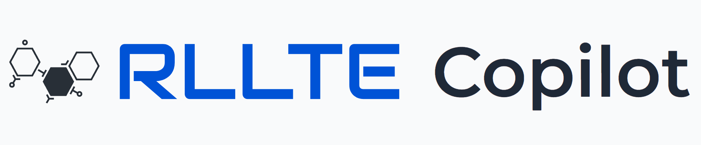
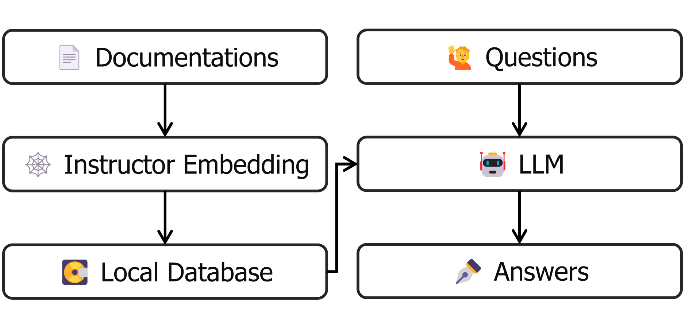
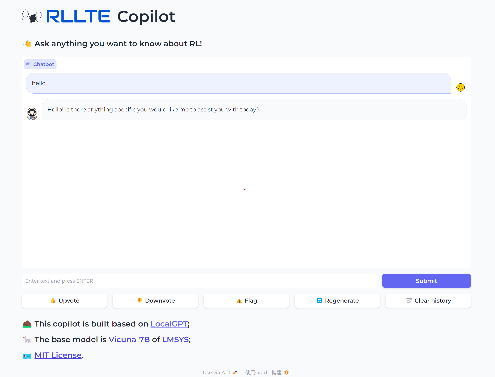

<div align=center>
<br>

<br>

RLLTE Copilot: LLM-Empowered Assistant for RL
</div>

# Introduction


**Copilot** is the first attempt to integrate an LLM into an RL framework, which aims to help developers reduce the learning cost and facilitate application construction. We follow the design of [LocalGPT](https://github.com/PromtEngineer/localGPT) that interacts privately with documents using the power of GPT. The source documents are first ingested by an instructor embedding tool to create a local vector database. After that, a local LLM is used to understand questions and create answers based on the database. In practice, we utilize **Vicuna-7B** as the base model and build the database using various corpora, including API documentation, tutorials, and RL references. The powerful understanding ability of the LLM model enables the copilot to accurately answer questions about the use of the framework and any other questions of RL. Moreover, no additional training is required, and users are free to replace the base model according to their computing power. In future work, we will further enrich the corpus and add the code completion function to build a more intelligent copilot for RL.

# Usage
## Online
We plan to deploy the **Copilot** on the Hugging Face platform. Currently, we're dealing with the problem of computing power. The online server is coming soon.

## Offline

Firstly, clone the repository by:
``` sh
git clone https://github.com/RLE-Foundation/rllte-copilot.git
```

Then install the necessary dependencies:
``` sh
pip install -r requirements.txt
```

Finally, open a terminal and run the `app.py`:
``` sh
python app.py
```

Launch the browser and you'll see the following page:

<div align=center>
<br>

<br>

RLLTE Copilot: LLM-Empowered Assistant for RL
</div>

## FAQ

- How to change the base LLM model?
<!--Replace the `MODEL_ID` and `MODEL_BASENAME` in `src/constants.py`, and the available options can be found in [Link](https://github.com/PromtEngineer/localGPT/blob/main/constants.py).-->
  
  
    Currently, our project utilizes the 'Llama-2-7b-Chat-GGUF' model due to its superior performance. However, we plan to expand the model selection options in the future. Thus, users will be able to select from a range of models to suit their specific needs.
